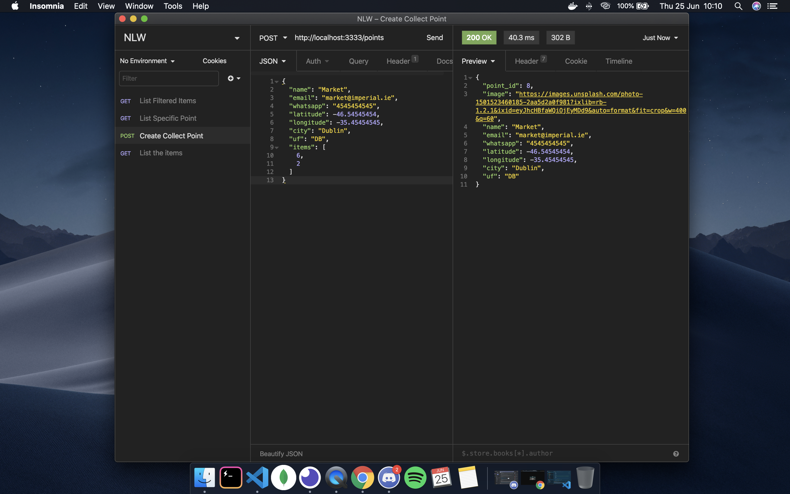
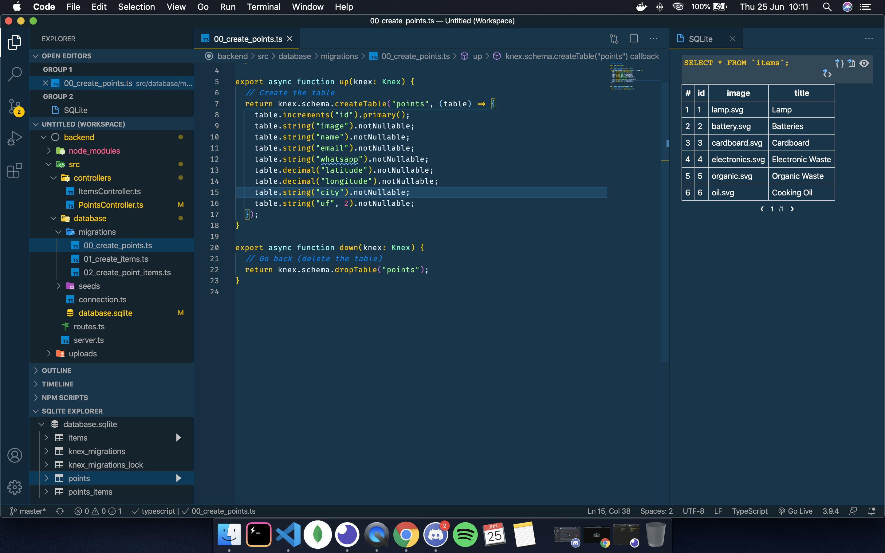
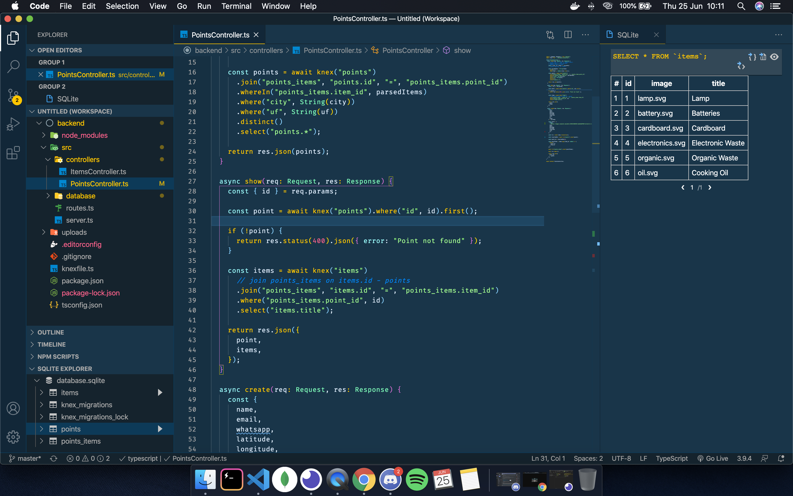

# Ecoleta-Backend

This is the backend of the **Ecoleta-Backend** project developed by [**_Rocketseat_**](https://rocketseat.com.br/), a Brazilian company that teaches Node.JS, ReactJS and React Native.
This is a project where I could learn many professional techniques that is used in "the real world".

## About the project

- The **Ecoleta-Backend** is an application that aims to establish a connection between companies that collect waste (organic and inorganic) to people that constantly need to dispose of this waste. Solving a major recurring problem that is the inappropriate disposal of garbage, facilitating the process of recycling and reuse.

## The backend

The backend was developed with [**_Node.js_**](https://nodejs.org/en/) and [**_Express.js_**](https://expressjs.com/) ( _framework_ ). The application is based on a server which is the [**_SQLite_**](https://www.sqlite.org/index.html).
The REST API was tested using [**_Insomnia_**](https://insomnia.rest/) and I also used [**Knex.js**](http://knexjs.org/) a SQL Query Builder for JavaScript, which helped by coding JavaScript in the SQLite to create the tables for each session in the backend.
I also used [**TypeScript**](https://www.typescriptlang.org/) in this application providing highly productive development tools for JavaScript IDEs and practices.

**Insomnia**

**create**

**Points Controller**

## Getting started

1.  Prerequisites

- npm

      npm install npm@latest -g

2. Installation

- Clone the repo

      git clone https://github.com/euguilhermegirardi/Ecoleta-Backend.git

3. Install NPM packages

       npm install

4. Run the application

       npm run knex:migrate
       npm run knex:seed
       npm run dev

## Contributing

1.  Fork the project
2.  Create your feature branch (`git checkout -b feature/AmazingFeature`)
3.  Commit your changes (`git commit -m 'Add some AmazingFeature'`)
4.  Push to the branch (`git push origin feature/AmazingFeature`)
5.  Open a pull request

## License

